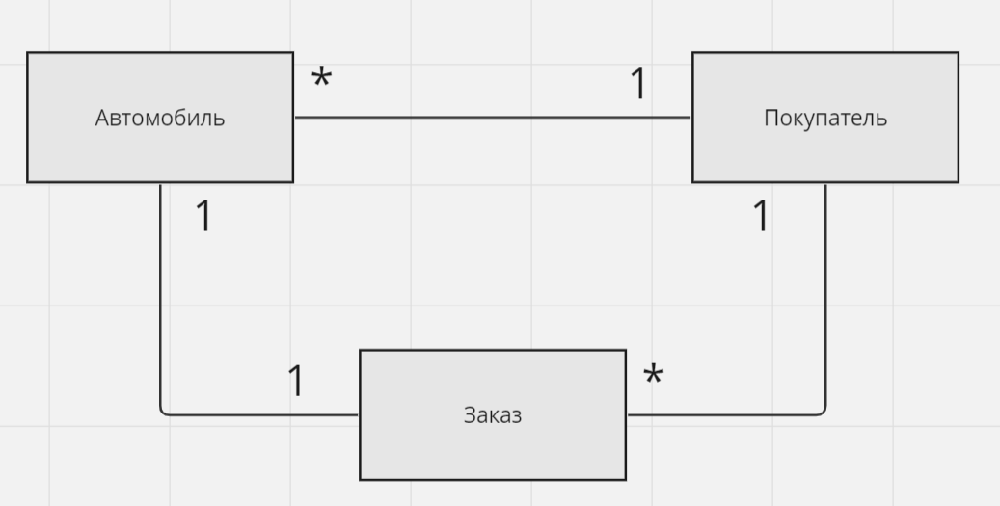

# CAR SALE

## Предметная область

Предметная область - продажа автомобилей в автосалоне. Данное web-приложение будет представлять из себя доску
объявлений (карточки
автомобилей с различными характеристиками).

## Сущности проекта

### Сущность "Автомобиль"

- **Название**: Car
- **Атрибуты**: id, brand, model, year, price, mileage, color
- **Комментарий**: информация о характеристиках автомобиля, которая может использоваться для отображения информации на
  карточках и для выполнения операций, связанных с продажей автомобилей.

### Сущность "Покупатель"

- **Название**: Customer
- **Атрибуты**: id, name, email, phone
- **Комментарий**: информация о покупателях автомобилей, использующаяся для оформления заказов и связи с покупателями.

### Сущность "Заказ"

- **Название**: Order
- **Атрибуты**: id, carId, customerId, date
- **Комментарий**: информация о заказах автомобилей для отслеживания заказов, связи автомобилей с покупателями и управления
  прцоессом продажи автомобилей.

### Диаграмма сущностей

